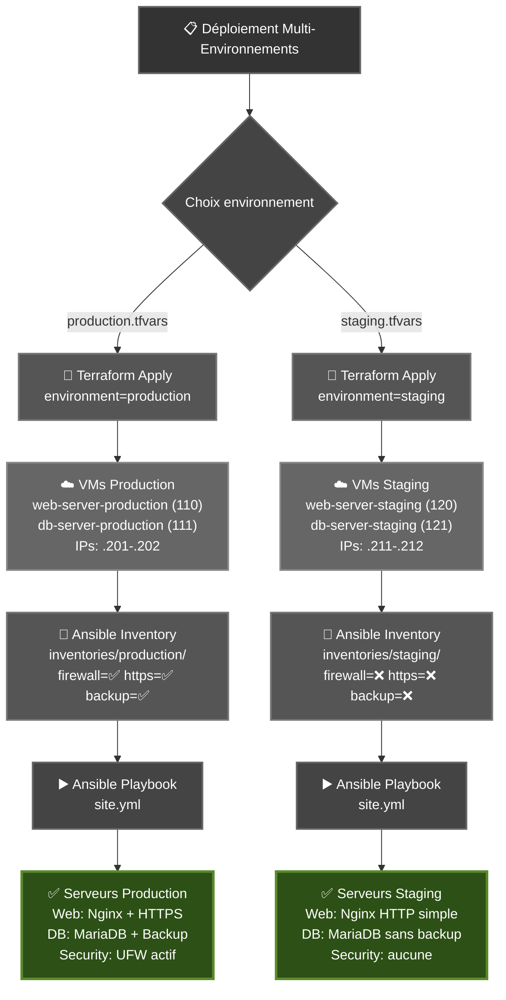

# Architecture Multi-Environnements - Terraform + Ansible

## Vue d'ensemble

Ce projet démontre une **architecture professionnelle** où Terraform et Ansible travaillent ensemble pour gérer plusieurs environnements (production, staging) **sans duplication de code**.

## 🏗️ Comment ça fonctionne

### 1. Terraform: Gestion des environnements via variables

**Fichier : `terraform/variables.tf`**
```hcl
variable "environment" {
  default = "production"  # ou "staging"
}

variable "vm_config" {
  default = {
    production = {
      web_vmid = 110
      web_ip   = "192.168.1.201"
      ...
    }
    staging = {
      web_vmid = 120
      web_ip   = "192.168.1.211"
      ...
    }
  }
}
```

**Fichier : `terraform/main.tf`**
```hcl
resource "proxmox_vm_qemu" "web_server" {
  name  = "web-server-${var.environment}"  # -production ou -staging
  vmid  = var.vm_config[var.environment].web_vmid
  ipconfig0 = "ip=${var.vm_config[var.environment].web_ip}/24"
}
```

### 2. Fichiers tfvars par environnement

**`terraform/production.tfvars`**
```hcl
environment = "production"
```

**`terraform/staging.tfvars`**
```hcl
environment = "staging"
```

### 3. Déploiement Terraform

```bash
# Production
terraform apply -var-file="production.tfvars"
# Créé: web-server-production (110), db-server-production (111)

# Staging
terraform apply -var-file="staging.tfvars"
# Créé: web-server-staging (120), db-server-staging (121)
```

### 4. Ansible: Variables par environnement

**Structure:**
```
ansible/inventories/
├── production/
│   ├── hosts.yml              # IPs: 192.168.1.201-202
│   └── group_vars/all.yml     # firewall_enabled=true, https_enabled=true
└── staging/
    ├── hosts.yml              # IPs: 192.168.1.211-212
    └── group_vars/all.yml     # firewall_enabled=false, https_enabled=false
```

**Déploiement Ansible:**
```bash
# Production (avec sécurité)
ansible-playbook -i inventories/production/hosts.yml site.yml -K

# Staging (sans sécurité)
ansible-playbook -i inventories/staging/hosts.yml site.yml -K
```

### 5. Rôles conditionnels

**`ansible/roles/security/tasks/main.yml`**
```yaml
- name: Configurer le firewall
  ufw: ...
  when: firewall_enabled | default(false)  # Seulement en production
```

**`ansible/roles/web/tasks/main.yml`**
```yaml
- name: Configurer HTTPS
  template:
    src: nginx-https.conf.j2
    dest: /etc/nginx/sites-available/default
  when: https_enabled | default(false)  # Seulement en production
```

## 📊 Flux de données



## 🎯 Avantages de cette architecture

### ✅ Code unique

- **1 seul** `main.tf` pour tous les environnements
- **1 seul** `site.yml` pour tous les environnements
- **1 seul** rôle `web`, `db`, `security`
- Variables différentes selon l'environnement

### ✅ Facile à étendre

Ajouter un environnement "preprod" :

1. Terraform: Ajouter dans `variables.tf`
   ```hcl
   preprod = {
     web_vmid = 130
     web_ip   = "192.168.1.221"
   }
   ```

2. Créer `preprod.tfvars`
   ```hcl
   environment = "preprod"
   ```

3. Ansible: Copier `inventories/staging/` → `inventories/preprod/`
4. Ajuster les IPs et variables dans `preprod/hosts.yml`

### ✅ Sécurité

- Production: Configuration sécurisée par défaut
- Staging: Configuration légère pour développement
- Impossible de déployer production sans HTTPS par erreur

### ✅ Maintenance simple

- Correction d'un bug dans `main.tf` → Affecte tous les environnements
- Amélioration d'un rôle → Affecte tous les environnements
- Pas de risque de désynchronisation

## 🔍 Exemple concret

### Déployer les deux environnements en parallèle

```bash
# Terminal 1: Production
./deploy-production.sh
# → Créé web/db-server-production
# → Configure avec HTTPS, Firewall, Backup

# Terminal 2: Staging  
./deploy-staging.sh
# → Créé web/db-server-staging
# → Configure sans sécurité (tests rapides)
```

### Tester un changement en staging d'abord

```bash
# 1. Modifier le playbook ou role
vim ansible/roles/web/tasks/main.yml

# 2. Test en staging
./deploy-staging.sh
curl http://192.168.1.211  # Vérifier

# 3. Si OK, déployer en production
git commit -m "feat: amélioration web role"
./deploy-production.sh
curl -k https://192.168.1.201  # Vérifier
```

### Détruire staging, garder production

```bash
cd terraform
terraform destroy -var-file="staging.tfvars"
# → Supprime seulement les VMs staging

terraform output -var-file="production.tfvars"
# → Production toujours active
```

## 📝 Checklist de validation

- [x] Terraform: Variable `environment` utilisée
- [x] Terraform: VMIDs différents par environnement
- [x] Terraform: IPs différentes par environnement  
- [x] Terraform: Noms de VMs incluent l'environnement
- [x] Ansible: Inventories séparés
- [x] Ansible: Variables par environnement
- [x] Ansible: Rôles avec conditions `when:`
- [x] Scripts de déploiement automatisés
- [x] Documentation complète

## 🎓 Concepts clés démontrés

1. **Infrastructure as Code** (IaC): Terraform
2. **Configuration Management**: Ansible
3. **Separation of Concerns**: Terraform = infra, Ansible = config
4. **DRY Principle**: Un seul code, plusieurs environnements
5. **Variables d'environnement**: Configuration externalisée
6. **Idempotence**: Playbooks relançables sans erreur
7. **Sécurité par défaut**: Production sécurisée automatiquement
8. **Conditionnalité**: Comportement différent selon l'environnement