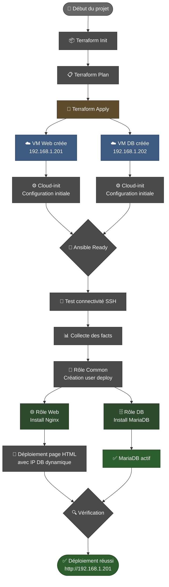

# Infrastructure Proxmox - Terraform + Ansible

Projet complet de déploiement et configuration d'infrastructure sur Proxmox :
- **Terraform** : Provisionnement des VMs (web + db)
- **Ansible** : Configuration automatisée avec rôles

## � Workflow de déploiement



## 📋 Services déployés
- **VM Web** : Nginx avec page affichant l'IP de la DB
- **VM DB** : MariaDB avec base de test
- **Utilisateur** : `deploy` créé sur les deux VMs

## 📁 Structure du projet

```
Ansible_Terraform_Proxmox/
├── terraform/              # Infrastructure as Code
│   ├── main.tf            # Définition des VMs
│   ├── provider.tf        # Configuration Proxmox
│   ├── variables.tf       # Variables Terraform
│   ├── outputs.tf         # IPs des VMs
│   └── terraform.tfvars   # Valeurs des variables
│
└── ansible/               # Configuration Management
    ├── site.yml           # Playbook principal
    ├── hosts.yml          # Inventory des serveurs (YAML)
    ├── ansible.cfg        # Configuration Ansible
    ├── requirements.yml   # Dépendances Ansible
    └── roles/
        ├── common/        # Utilisateur deploy
        ├── web/           # Nginx + page HTML
        └── db/            # MariaDB

```

## 🚀 Déploiement complet

### Étape 1 : Prérequis

```bash
# Terraform
terraform version  # v1.0+

# Ansible
ansible --version  # v2.9+
```

### Étape 2 : Provisionner l'infrastructure avec Terraform

```bash
cd terraform/

# Initialiser Terraform
terraform init

# Vérifier le plan
terraform plan

# Créer les VMs
terraform apply

# Voir les IPs des VMs
terraform output
```

### Étape 3 : Configurer les serveurs avec Ansible

```bash
cd ../ansible/

# Installer les collections nécessaires
ansible-galaxy collection install -r requirements.yml

# Tester la connectivité SSH
ansible all -m ping

# Lancer la configuration complète
ansible-playbook site.yml
```

### Étape 4 : Vérification

Accédez à **http://192.168.1.201** dans votre navigateur.
Vous devriez voir une page Nginx affichant l'IP du serveur de base de données.

## 🔧 Commandes utiles

### Terraform

```bash
# Voir l'état actuel
terraform show

# Détruire l'infrastructure
terraform destroy

# Appliquer un module spécifique
terraform apply -target=proxmox_vm_qemu.web_server
```

### Ansible

```bash
# Exécuter uniquement sur web
ansible-playbook site.yml --limit web

# Exécuter uniquement sur db
ansible-playbook site.yml --limit db

# Mode dry-run (vérification)
ansible-playbook site.yml --check

# Verbose mode
ansible-playbook site.yml -v
```

## 📦 VMs créées

| Nom | IP | Services | Specs |
|-----|-----|----------|-------|
| web-server | 192.168.1.201 | Nginx | 2 CPU, 2GB RAM, 20GB disk |
| db-server | 192.168.1.202 | MariaDB | 2 CPU, 2GB RAM, 20GB disk |

## 🔑 Authentification

- **Utilisateur système** : `jordan` (configuré par cloud-init)
- **Utilisateur déploiement** : `deploy` (créé par Ansible)
- **Clé SSH** : ssh-ed25519 (définie dans terraform/main.tf)

## ✅ Fonctionnalités

### Terraform
- ✅ Templates Proxmox (Debian 12)
- ✅ Configuration réseau statique
- ✅ Cloud-init pour l'initialisation
- ✅ QEMU Guest Agent activé

### Ansible
- ✅ Rôles modulaires (common, web, db)
- ✅ Playbook idempotent
- ✅ Handlers pour les services
- ✅ Templates Jinja2
- ✅ Variables d'inventory dynamiques

## 🔄 Workflow complet

```bash
# 1. Créer l'infrastructure
cd terraform && terraform apply && cd ..

# 2. Configurer les serveurs
cd ansible && ansible-playbook site.yml

# 3. Vérifier le déploiement
curl http://192.168.1.201

# 4. Détruire (si nécessaire)
cd terraform && terraform destroy
```

## 📝 Notes

- Les VMs utilisent le template `debian12-template` (doit exister dans Proxmox)
- Le réseau est configuré sur `vmbr0` (bridge par défaut)
- Les IPs sont statiques (192.168.1.201 et 192.168.1.202)
- Le mot de passe par défaut est `Serveur1234` (à changer en production)

## 🛠️ Troubleshooting

### Terraform ne trouve pas le template
```bash
# Vérifier les templates disponibles dans Proxmox
qm list
```

### Ansible ne peut pas se connecter
```bash
# Tester SSH manuellement
ssh jordan@192.168.1.201

# Vérifier l'inventory
ansible-inventory --list
```

### Les VMs ne répondent pas
```bash
# Vérifier que le QEMU Guest Agent est actif
qm agent <vmid> ping
```

## 📚 Ressources

- [Terraform Proxmox Provider](https://registry.terraform.io/providers/Telmate/proxmox/latest/docs)
- [Ansible Documentation](https://docs.ansible.com/)
- [Proxmox VE Documentation](https://pve.proxmox.com/wiki/Main_Page)
