# Architecture Multi-Environnements - Terraform + Ansible

## 📋 Vue d'ensemble

Ce projet démontre une **architecture professionnelle** où Terraform et Ansible travaillent ensemble pour gérer plusieurs environnements (production, staging) **sans duplication de code**.

**Stack technique :**
- 🏗️ **Terraform** : Provisionnement infrastructure Proxmox
- ⚙️ **Ansible** : Configuration automatisée avec rôles
- 🌐 **Nginx** : Serveur web (HTTPS en production)
- 🗄️ **MariaDB** : Base de données avec backup automatique
- 🔒 **UFW** : Firewall (production uniquement)

## 🚀 Déploiement rapide

### Déploiement simple (main)
```bash
./deploy.sh
```

### Déploiement Production
```bash
./deploy-production.sh
```
✅ HTTPS + Firewall + Backup DB automatique

### Déploiement Staging
```bash
./deploy-staging.sh
```
✅ Configuration légère pour tests rapides

## 🏗️ Comment ça fonctionne

### 1. Terraform: Gestion des environnements via variables

**Fichier : `terraform/variables.tf`**
```hcl
variable "environment" {
  default = "production"  # ou "staging"
}

variable "vm_config" {
  default = {
    production = {
      web_vmid = 110
      web_ip   = "192.168.1.201"
      ...
    }
    staging = {
      web_vmid = 120
      web_ip   = "192.168.1.211"
      ...
    }
  }
}
```

**Fichier : `terraform/main.tf`**
```hcl
resource "proxmox_vm_qemu" "web_server" {
  name  = "web-server-${var.environment}"  # -production ou -staging
  vmid  = var.vm_config[var.environment].web_vmid
  ipconfig0 = "ip=${var.vm_config[var.environment].web_ip}/24"
}
```

### 2. Fichiers tfvars par environnement

**`terraform/production.tfvars`**
```hcl
environment = "production"
```

**`terraform/staging.tfvars`**
```hcl
environment = "staging"
```

### 3. Déploiement Terraform

```bash
# Production
terraform apply -var-file="production.tfvars"
# Créé: web-server-production (110), db-server-production (111)

# Staging
terraform apply -var-file="staging.tfvars"
# Créé: web-server-staging (120), db-server-staging (121)
```

### 4. Ansible: Variables par environnement

**Structure:**
```
ansible/inventories/
├── production/
│   ├── hosts.yml              # IPs: 192.168.1.201-202
│   └── group_vars/all.yml     # firewall_enabled=true, https_enabled=true
└── staging/
    ├── hosts.yml              # IPs: 192.168.1.211-212
    └── group_vars/all.yml     # firewall_enabled=false, https_enabled=false
```

**Déploiement Ansible:**
```bash
# Production (avec sécurité)
ansible-playbook -i inventories/production/hosts.yml site.yml -K

# Staging (sans sécurité)
ansible-playbook -i inventories/staging/hosts.yml site.yml -K
```

### 5. Rôles conditionnels

**`ansible/roles/security/tasks/main.yml`**
```yaml
- name: Configurer le firewall
  ufw: ...
  when: firewall_enabled | default(false)  # Seulement en production
```

**`ansible/roles/web/tasks/main.yml`**
```yaml
- name: Configurer HTTPS
  template:
    src: nginx-https.conf.j2
    dest: /etc/nginx/sites-available/default
  when: https_enabled | default(false)  # Seulement en production
```

## 📊 Flux de données

```mermaid
flowchart TD
    Start["📋 Déploiement Multi-Environnements"]
    
    Start --> TFVars{"Choix environnement"}
    
    TFVars -->|production.tfvars| ProdTF["🔧 Terraform Apply<br/>environment=production"]
    TFVars -->|staging.tfvars| StageTF["🔧 Terraform Apply<br/>environment=staging"]
    
    ProdTF --> ProdVMs["☁️ VMs Production<br/>web-server-production (110)<br/>db-server-production (111)<br/>IPs: .201-.202"]
    StageTF --> StageVMs["☁️ VMs Staging<br/>web-server-staging (120)<br/>db-server-staging (121)<br/>IPs: .211-.212"]
    
    ProdVMs --> ProdInv["📝 Ansible Inventory<br/>inventories/production/<br/>firewall=✅ https=✅ backup=✅"]
    StageVMs --> StageInv["📝 Ansible Inventory<br/>inventories/staging/<br/>firewall=❌ https=❌ backup=❌"]
    
    ProdInv --> ProdPlay["▶️ Ansible Playbook<br/>site.yml"]
    StageInv --> StagePlay["▶️ Ansible Playbook<br/>site.yml"]
    
    ProdPlay --> ProdFinal["✅ Serveurs Production<br/>Web: Nginx + HTTPS<br/>DB: MariaDB + Backup<br/>Security: UFW actif"]
    StagePlay --> StageFinal["✅ Serveurs Staging<br/>Web: Nginx HTTP simple<br/>DB: MariaDB sans backup<br/>Security: aucune"]
    
    style Start fill:#333,stroke:#666,color:#fff,stroke-width:2px
    style TFVars fill:#444,stroke:#666,color:#fff,stroke-width:2px
    style ProdTF fill:#555,stroke:#777,color:#fff,stroke-width:2px
    style StageTF fill:#555,stroke:#777,color:#fff,stroke-width:2px
    style ProdVMs fill:#666,stroke:#888,color:#fff,stroke-width:2px
    style StageVMs fill:#666,stroke:#888,color:#fff,stroke-width:2px
    style ProdInv fill:#555,stroke:#777,color:#fff,stroke-width:2px
    style StageInv fill:#555,stroke:#777,color:#fff,stroke-width:2px
    style ProdPlay fill:#444,stroke:#666,color:#fff,stroke-width:2px
    style StagePlay fill:#444,stroke:#666,color:#fff,stroke-width:2px
    style ProdFinal fill:#2d5016,stroke:#5a8a2d,color:#fff,stroke-width:3px
    style StageFinal fill:#2d5016,stroke:#5a8a2d,color:#fff,stroke-width:3px
```



## 🎯 Avantages de cette architecture

### ✅ Code unique

- **1 seul** `main.tf` pour tous les environnements
- **1 seul** `site.yml` pour tous les environnements
- **1 seul** rôle `web`, `db`, `security`
- Variables différentes selon l'environnement

### ✅ Facile à étendre

Ajouter un environnement "preprod" :

1. Terraform: Ajouter dans `variables.tf`
   ```hcl
   preprod = {
     web_vmid = 130
     web_ip   = "192.168.1.221"
   }
   ```

2. Créer `preprod.tfvars`
   ```hcl
   environment = "preprod"
   ```

3. Ansible: Copier `inventories/staging/` → `inventories/preprod/`
4. Ajuster les IPs et variables dans `preprod/hosts.yml`

### ✅ Sécurité

- Production: Configuration sécurisée par défaut
- Staging: Configuration légère pour développement
- Impossible de déployer production sans HTTPS par erreur

### ✅ Maintenance simple

- Correction d'un bug dans `main.tf` → Affecte tous les environnements
- Amélioration d'un rôle → Affecte tous les environnements
- Pas de risque de désynchronisation

## 🔍 Exemple concret

### Déployer les deux environnements en parallèle

```bash
# Terminal 1: Production
./deploy-production.sh
# → Créé web/db-server-production
# → Configure avec HTTPS, Firewall, Backup

# Terminal 2: Staging  
./deploy-staging.sh
# → Créé web/db-server-staging
# → Configure sans sécurité (tests rapides)
```

### Tester un changement en staging d'abord

```bash
# 1. Modifier le playbook ou role
vim ansible/roles/web/tasks/main.yml

# 2. Test en staging
./deploy-staging.sh
curl http://192.168.1.211  # Vérifier

# 3. Si OK, déployer en production
git commit -m "feat: amélioration web role"
./deploy-production.sh
curl -k https://192.168.1.201  # Vérifier
```

### Détruire staging, garder production

```bash
cd terraform
terraform destroy -var-file="staging.tfvars"
# → Supprime seulement les VMs staging

terraform output -var-file="production.tfvars"
# → Production toujours active
```

## 📝 Checklist de validation

- [x] Terraform: Variable `environment` utilisée
- [x] Terraform: VMIDs différents par environnement
- [x] Terraform: IPs différentes par environnement  
- [x] Terraform: Noms de VMs incluent l'environnement
- [x] Ansible: Inventories séparés
- [x] Ansible: Variables par environnement
- [x] Ansible: Rôles avec conditions `when:`
- [x] Scripts de déploiement automatisés
- [x] Documentation complète

## 🔐 Sécurité (Production uniquement)

### Firewall UFW
- Ports autorisés : **22** (SSH), **80** (HTTP), **443** (HTTPS)
- Politique par défaut : DENY incoming, ALLOW outgoing
- Configuration idempotente

```bash
# Vérifier le firewall
ssh jordan@192.168.1.201
sudo ufw status
```

### HTTPS
- Certificat SSL auto-signé avec SubjectAltName (IP + domaine)
- Redirect automatique HTTP → HTTPS
- Headers de sécurité (HSTS, X-Frame-Options, CSP)
- TLS 1.2/1.3 uniquement

```bash
# Accès HTTPS (accepter le certificat)
curl -k https://192.168.1.201
# ou : https://web-prod.local
```

## 💾 Backup Base de Données

### Configuration (Production)
- **Fréquence** : Tous les jours à 2h du matin
- **Emplacement** : `/var/backups/mariadb/`
- **Rétention** : 7 jours
- **Format** : SQL compressé (.sql.gz)

### Vérifier les backups
```bash
ssh jordan@192.168.1.202
ls -lh /var/backups/mariadb/
tail -f /var/log/mysql_backup.log
```

### Tester manuellement
```bash
ssh jordan@192.168.1.202
sudo /usr/local/bin/backup_mysql.sh
```

## 🧪 Tests et validation

### Web
```bash
# Production (HTTPS)
curl -k https://192.168.1.201

# Staging (HTTP)
curl http://192.168.1.211
```

### Firewall
```bash
ssh jordan@192.168.1.201 "sudo ufw status"
```

### Cron job backup
```bash
ssh jordan@192.168.1.202 "sudo crontab -l"
```

### Badge environnement
La page web affiche automatiquement :
- 🔴 Badge production ou 🟠 Badge staging
- État HTTPS, Firewall, Backup DB

## 📊 Variables par environnement

| Variable | Production | Staging |
|----------|-----------|---------|
| `environment_name` | production | staging |
| `firewall_enabled` | ✅ true | ❌ false |
| `https_enabled` | ✅ true | ❌ false |
| `db_backup_enabled` | ✅ true | ❌ false |
| `nginx_server_name` | web-prod.local | web-staging.local |
| `db_backup_schedule` | "0 2 * * *" | N/A |

## 🔄 Idempotence

Le playbook est **100% idempotent**. Relancez-le sans crainte :

```bash
./deploy-production.sh
./deploy-production.sh  # ← Aucun changement, tout en "ok"
```

## 🛠️ Commandes utiles

```bash
# Lister l'inventory
ansible-inventory -i ansible/inventories/production/hosts.yml --list

# Mode dry-run (test sans appliquer)
ansible-playbook -i ansible/inventories/production/hosts.yml ansible/site.yml --check

# Mode verbose (debug)
ansible-playbook -i ansible/inventories/production/hosts.yml ansible/site.yml -vv

# Exécuter seulement certains tags
ansible-playbook -i ansible/inventories/production/hosts.yml ansible/site.yml --tags backup

# Vérifier la syntaxe
ansible-playbook ansible/site.yml --syntax-check

# Terraform : détruire un environnement
cd terraform
terraform destroy -var-file="staging.tfvars"  # Garde production
```

## 🎓 Concepts clés démontrés

1. **Infrastructure as Code** (IaC): Terraform
2. **Configuration Management**: Ansible  
3. **Separation of Concerns**: Terraform = infra, Ansible = config
4. **DRY Principle**: Un seul code, plusieurs environnements
5. **Variables d'environnement**: Configuration externalisée
6. **Idempotence**: Playbooks relançables sans erreur
7. **Sécurité par défaut**: Production sécurisée automatiquement
8. **Conditionnalité**: Comportement différent selon l'environnement

## 📝 Notes importantes

- **Certificat SSL** : Auto-signé, le navigateur affichera un avertissement
- **Mot de passe sudo** : Flag `-K` dans les scripts demande le mot de passe
- **Parallélisme Terraform** : Configuré à 2 pour créer les VMs simultanément
- **DNS local** : Ajoutez les entrées dans `/etc/hosts` pour utiliser les noms de domaine

## 🚀 Pour aller plus loin

- 🔐 Intégrer **Vault** pour les secrets
- ☁️ Utiliser **Terraform Cloud** pour le state distant
- 📊 Ajouter **monitoring** (Prometheus, Grafana)
- 🔄 Implémenter **blue/green deployment**

- **DNS local** : Ajoutez les entrées dans `/etc/hosts` pour utiliser les noms de domaine